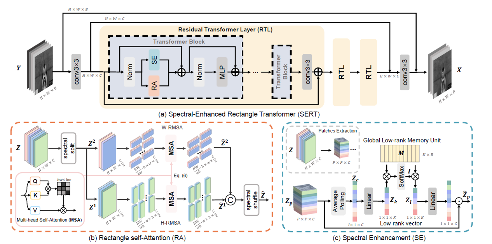

# 复现的论文：Spectral Enhanced Rectangle Transformer for Hyperspectral Image Denoising

Miaoyu Li, Ji Liu, [Ying Fu](https://ying-fu.github.io/), [Yulun Zhang](http://yulunzhang.com/), and Dejing Dou, "Spectral Enhanced Rectangle Transformer for Hyperspectral Image Denoising" CVPR 2023

[Arxiv](http://arxiv.org/abs/2304.00844) 


<hr />

> **Abstract:**  Denoising is a crucial step for Hyperspectral image (HSI) applications. Though witnessing the great power of deep learning, existing HSI denoising methods suffer from limitations in capturing the non-local self-similarity. Transformers have shown potential in capturing long-range dependencies, but few attempts have been made with specifically designed Transformer to model the spatial and spectral correlation in HSIs. In this paper, we address these issues by proposing a spectral enhanced rectangle Transformer, driving it to explore the non-local spatial similarity and global spectral low-rank property of HSIs. For the former, we exploit the rectangle self-attention horizontally and vertically to capture the non-local similarity in the spatial domain. For the latter, we design a spectral enhancement module that is capable
of extracting global underlying low-rank property of spatial-spectral cubes to suppress noise, while enabling the interactions among non-overlapping spatial rectangles. Extensive experiments have been conducted on both synthetic noisy HSIs and real noisy HSIs, showing the effectiveness of our proposed method in terms of both objective metric and subjective visual quality.
<hr />

## 网络框架

 


## 数据集

### ICVL 数据集
* ICVL 下载链接： 

  https://aistudio.baidu.com/datasetdetail/171928

  https://aistudio.baidu.com/datasetdetail/171934
1. 根据 utility/icvl_partition/icvl_train_list.txt 分离训练集和测试集。
2. 生成训练用的 lmdb 数据集

```
python utility/lmdb_data.py
```

### Realistic 数据集
* 下载链接：https://github.com/ColinTaoZhang/HSIDwRD

根据 utility/realistic_partition/test.txt 分离训练集和测试集。


## 训练和测试
### ICVL 数据集
```
#for gaussian noise
#----training----
python hside_simu.py -a sert_base -p sert_base_gaussian

#----testing---- The results are shown in Table 1 in the main paper.
python hside_simu_test.py -a sert_base -p sert_base_gaussian_test -r -rp checkpoints/icvl_gaussian.pth --test-dir /icvl_noise/512_50
```

```
#for comlpex noise
#----training----
python hside_simu_complex.py -a sert_base -p sert_base_complex

#----testing---- The results are shown in Table 2 in the main paper.
python hside_simu_test.py -a sert_base -p sert_base_complex_test -r -rp checkpoints/icvl_complex.pth --test-dir  /icvl_noise/512_mix
```

### Realistic 数据集
```
#----training----
python hside_real.py -a sert_real -p sert_real

#----testing---- The results are shown in Table 3 in the main paper.
python hside_real_test.py -a sert_real -p sert_real_test -r -rp ./checkpoints/real_realistic.pth
```
